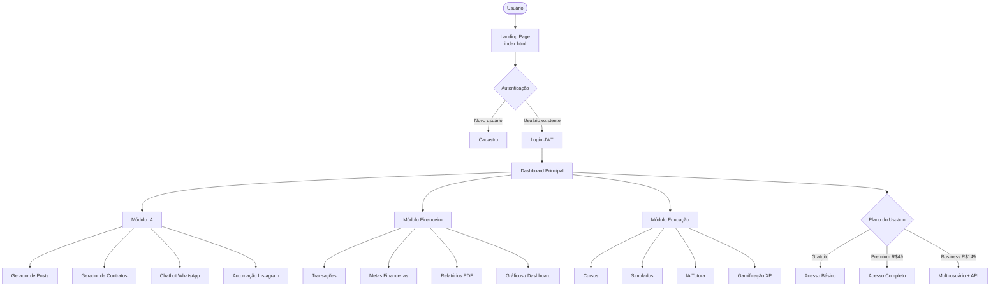
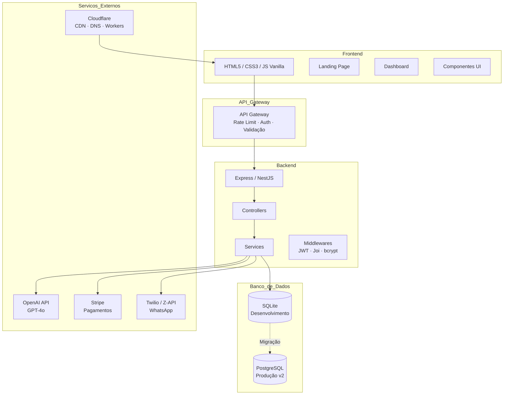
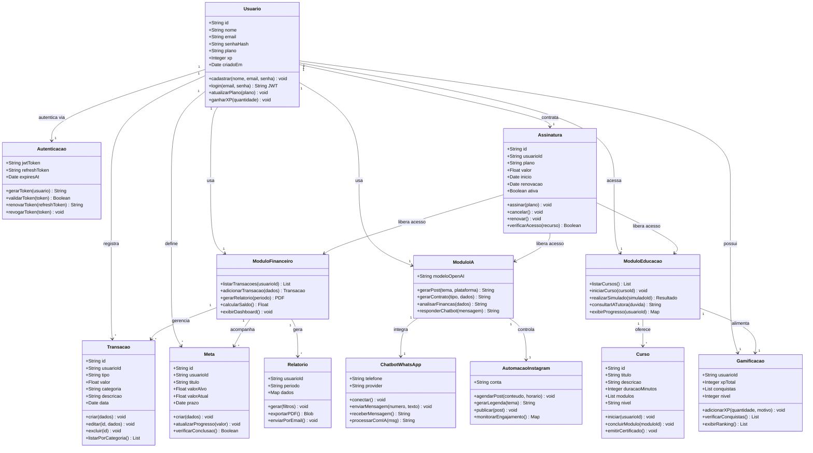
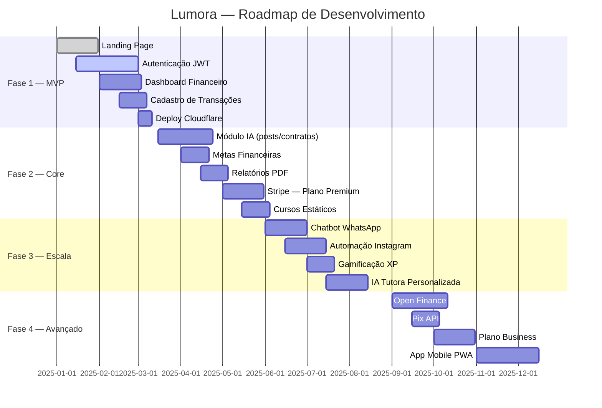

# LUMORA-APP
Uma plataforma web moderna desenvolvida para oferecer praticidade em seus investimentos, com um bom desempenho e uma experiência intuitiva aos usuários.

# Lumora — Inteligência Financeira com IA

> Plataforma SaaS completa para pequenos negócios: gestão financeira moderna, automações com IA e educação em investimentos.

![Status] (https://img.shields.io/badge/status-em%20desenvolvimento-yellow)
![Stack] (https://img.shields.io/badge/stack-Node.js%20%7C%20HTML%20%7C%20CSS%20%7C%20JS-blue)
![Licença] (https://img.shields.io/badge/licença-MIT-green)

---

## Visão do Produto

A **Lumora** é uma plataforma SaaS com três módulos integrados:

| Módulo | Descrição |
|---|---|
| **IA para Negócios** | Geração de posts, contratos, chatbot WhatsApp, automação Instagram |
| **Gestão Financeira** | Dashboard moderno, controle de receitas/gastos, metas, relatórios |
| **Educação Financeira** | Cursos, simulados, IA tutora, gamificação com XP |

---

## Diagrama de Fluxo do Sistema



---

## Arquitetura do Sistema



---

## Diagrama de Classes



---

## Funcionalidades por Módulo

### Autenticação
| Funcionalidade | Detalhes |
|---|---|
| Cadastro | Nome, e-mail, senha com hash bcrypt (salt 12) |
| Login | JWT + Refresh Token armazenado em httpOnly cookie |
| Proteção de rotas | Middleware de autenticação em todos os endpoints privados |
| Rate limiting | Limite de requisições por IP e por usuário |
| Recuperação de senha | Envio de token por e-mail |

---

### Módulo Financeiro
| Funcionalidade | Detalhes |
|---|---|
| Dashboard | Visão geral de saldo, receitas e despesas com gráficos |
| Cadastro de transações | Tipo (receita/despesa), valor, categoria, descrição e data |
| Metas financeiras | Definição de valor-alvo, prazo e acompanhamento de progresso |
| Relatórios | Geração e exportação em PDF por período |
| Categorização | Organização automática de gastos por categoria |

---

### Módulo de IA para Negócios
| Funcionalidade | Detalhes |
|---|---|
| Gerador de Posts | Cria conteúdo para redes sociais com base no tema e plataforma |
| Gerador de Contratos | Gera contratos personalizados por tipo (prestação de serviço, etc.) |
| Chatbot WhatsApp | Atendimento automatizado via Twilio / Z-API |
| Automação Instagram | Agendamento e publicação de posts com legenda gerada por IA |
| Análise Financeira | IA interpreta dados financeiros e gera insights |

---

### Módulo de Educação Financeira
| Funcionalidade | Detalhes |
|---|---|
| Cursos | Conteúdo estruturado por módulos e níveis |
| Simulados | Questões com base em dados financeiros reais |
| IA Tutora | Responde dúvidas financeiras em linguagem natural |
| Gamificação | Sistema de XP, níveis e conquistas por progresso |
| Certificados | Emissão ao concluir cursos |

---

### Planos e Monetização
| Plano | Preço | Recursos |
|---|---|---|
| **Gratuito** | R$ 0/mês | Dashboard básico, 10 transações/mês |
| **Premium** | R$ 49/mês | Todos os módulos, relatórios, IA ilimitada |
| **Business** | R$ 149/mês | Multi-usuário, API pública, Open Finance |

**Meta MRR Ano 1:** R$ 15.000/mês (300 assinantes premium)

---

## Roadmap



---

## Estrutura de Pastas

```
lumora/
├── frontend/
│   ├── index.html              # Landing page
│   ├── css/
│   │   └── styles.css
│   ├── js/
│   │   └── script.js
│   └── assets/
│       ├── icons/
│       └── images/
│
├── backend/
│   ├── src/
│   │   ├── routes/             # Rotas da API
│   │   ├── controllers/        # Lógica dos endpoints
│   │   ├── middleware/         # Auth, validação, rate limit
│   │   ├── models/             # Modelos do banco de dados
│   │   └── services/           # Regras de negócio, IA
│   └── config/
│       ├── database.js
│       └── env.example
│
├── database/
│   └── migrations/             # Scripts SQL
│
├── docs/
│   ├── api.md                  # Documentação da API
│   ├── database.md             # Schema do banco
│   └── roadmap.md              # Roadmap do produto
│
├── api/
│   └── openapi.yaml            # Spec OpenAPI 3.0
│
├── .github/
│   └── workflows/
│       └── deploy.yml          # CI/CD pipeline
│
└── README.md
```

---

## Segurança

| Camada | Implementação |
|---|---|
| Senhas | bcrypt com salt rounds: 12 |
| Tokens | JWT + httpOnly cookies |
| Endpoints | Rate limiting por IP e por usuário |
| Dados | Criptografia em repouso |
| Conformidade | LGPD compliant desde o início |

---

## Stack Tecnológico

| Camada | Tecnologia |
|---|---|
| **Frontend** | HTML5, CSS3, JavaScript (vanilla) |
| **Autenticação** | JWT + Refresh Token |
| **Banco v1** | SQLite |
| **Banco v2** | PostgreSQL (escala) |
| **IA** | OpenAI API (GPT-4o) |
| **Pagamentos** | Stripe |
| **WhatsApp** | Twilio / Z-API |
| **Infra** | Cloudflare (DNS, CDN, Workers) |
| **CI/CD** | GitHub Actions |

---
## Licença

Este projeto está sob a licença MIT.  
Sinta-se livre para usar, modificar e distribuir este projeto.

MIT License © 2026 Arthur
---
