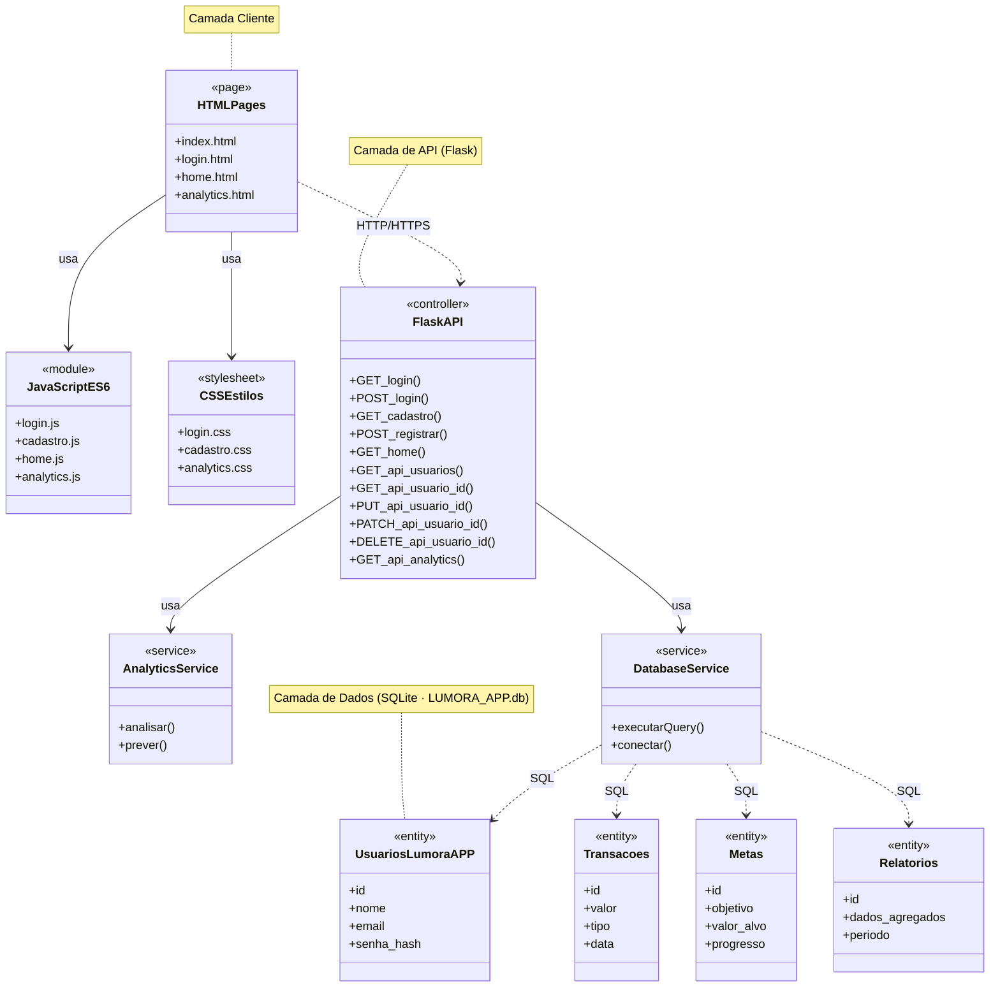
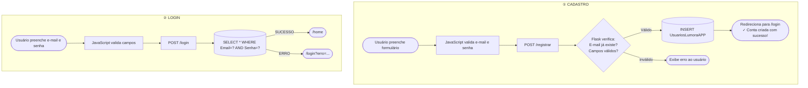
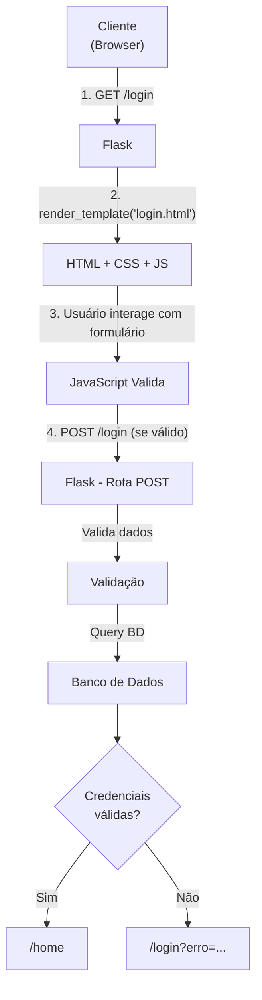
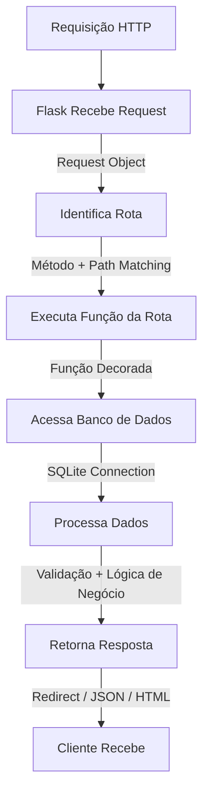

<h1 align="center"> Lumora - Inteligência Financeira com IA </h1>

<div align="center">
<h7> Copyright (c) 2026 Arthur </h7>

<h10 align="center"> Plataforma de gestão financeira inteligente com análise de dados e previsões baseadas em IA </h10>
<p>


</p>

<p align="center">
  <a href="https://github.com/ArthurHenrique-eng?tab=repositories">
    
  </a>
  <a href="https://github.com/ArthurHenrique-eng?tab=repositories">
    
  </a>
  <a href="https://github.com/ArthurHenrique-eng?tab=repositories">
    
  </a>
  <a href="https://github.com/ArthurHenrique-eng?tab=repositories">
    
  </a>
  <a href="https://github.com/ArthurHenrique-eng?tab=repositories">
    
  </a>
</p>
</div>

---
<div align="center">
<h3 align="center"> Navegação Rápida </h3>
<p>

[](#sobre)
[](#arquitetura)
[](#instalação-e-setup)

[](#como-usar)
[](#estrutura-do-projeto)
[](#api-endpoints)
[](#diagramas)

[](#contato)
[](#faq)
[](#suporte)

[](#licenca)
</p>
</div>

---
<div align="center">
<h3 id="sobre"> Sobre o projeto </h3>
</div>

**LUMORA APP** é uma aplicação web moderna de gestão financeira que utiliza inteligência artificial para fornecer insights inteligentes e previsões de crescimento financeiro. A plataforma permite que usuários:

- ✅ Gerenciem contas com autenticação segura
- ✅ Acessem dashboards financeiros em tempo real
- ✅ Recebam insights inteligentes baseados em IA
- ✅ Visualizem relatórios detalhados e análises
- ✅ Automatizem tarefas financeiras repetitivas
- ✅ Estabeleçam e acompanhem metas financeiras
---

<div align="center">
<h3 id="arquitetura"> Arquitetura do projeto </h3>


---
<h3> Fluxo de autenticação </h3>


---
<h3> Modelo de Dados </h3>
</div>

```sql
-- Tabela de Usuários
CREATE TABLE UsuariosLumoraAPP (
    IDUsuariosLumora INTEGER NOT NULL PRIMARY KEY AUTOINCREMENT,
    Email TEXT NOT NULL UNIQUE,
    Senha TEXT NOT NULL,
    DataCriacao TIMESTAMP DEFAULT CURRENT_TIMESTAMP
);

-- Exemplo de dados
┌────┬──────────────────┬──────────────┬───────────────────┐
│ ID │ Email            │ Senha        │ DataCriacao       │
├────┼──────────────────┼──────────────┼───────────────────┤
│ 1  │ joao@email.com   │ senha123456  │ 2026-06-01 10:30 │
│ 2  │ maria@email.com  │ senha789012  │ 2026-06-02 14:45 │
└────┴──────────────────┴──────────────┴───────────────────┘
```

---
<div align="center">
<h3 id="instalação-e-setup"> Instalação e Setup </h3> 
</div>

<h3> Pré requisitos para rodar </h3>

```bash
- Python 3.8 ou superior
- Git instalado
- Terminal/Prompt de comando
- Editor de código (VSCode recomendado)
```

<h3> Passo 1: Clonar o Repositório </h3>

```bash
git clone https://github.com/seu-usuario/LUMORA-APP.git
cd LUMORA-APP
```

<h3> Passo 2: Criar e Ativar Ambiente Virtual </h3>

**No Windows:**
```bash
python -m venv venv
venv\Scripts\activate
```

**No macOS/Linux:**
```bash
python3 -m venv venv
source venv/bin/activate
```

<h3> Passo 3: Instalar Dependências </h3>

```bash
pip install -r requirements.txt
```

<h3> Passo 4: Inicializar Banco de Dados </h3>

```bash
cd python
python init_db.py
cd ..
```

Você verá a mensagem: `Banco de dados inicializado com sucesso!`

<h3> Passo 5: Iniciar Servidor Flask </h3>

```bash
cd python
python app.py
```

A aplicação estará disponível em:
```
http://localhost:5000 (ambiente virtual do seu computador)
```

---

<div align="center">
<h3 id="como-usar"> Como Utilizar </h3> 
</div>

```bash
#### 1. **Acessar a Página Inicial**
- Você verá a página de boas-vindas com informações sobre a LUMORA

#### 2. **Criar Uma Conta**
- Clique em "Criar conta" ou acesse `/cadastro`
- Preencha os campos:
  - Email (ex: usuario@email.com)
  - Senha (mínimo 6 caracteres)
  - Confirmar senha
- Clique em "Criar conta"
- Será redirecionado para login com mensagem de sucesso

#### 3. **Fazer Login**
- Acesse `/login`
- Preencha email e senha da conta criada
- Clique em "Entrar"
- Será redirecionado para `/home` (Dashboard)

#### 4. **Explorar o Dashboard**
- Na página home, você terá acesso a:
  - Resumo financeiro
  - Gráficos e análises
  - Relatórios
  - Metas e automações

#### 5. **Acessar Analytics**
- Clique em "Analytics" no menu
- Visualize KPIs e previsões de crescimento
- Gere e envie relatórios por email
```
---

<div align="center">
<h3 id="estrutura-do-projeto"> Estrutura do Projeto </h3> 
</div>


---
<div align="center">
<h3 id="api-endpoints"> API Endpoints </h3> 
</div>

### Endpoints de Renderização (GET)

| Método | Rota | Descrição |
|--------|------|-----------|
| GET | `/` | Página inicial |
| GET | `/index.html` | Página inicial (alternativa) |
| GET | `/login` | Formulário de login |
| GET | `/login.html` | Formulário de login (alternativa) |
| GET | `/cadastro` | Formulário de cadastro |
| GET | `/cadastro.html` | Formulário de cadastro (alternativa) |
| GET | `/home` | Dashboard do usuário |
| GET | `/usuario` | Dashboard (alternativa) |
| GET | `/analytics` | Página de analytics |
| GET | `/recuperar-senha.html` | Recuperação de senha |

### Endpoints de Autenticação (POST)

#### Login
```
POST /login
Content-Type: application/x-www-form-urlencoded

email=usuario@email.com
password=senha123456

Resposta bem-sucedida: 302 Redirect → /home
Resposta com erro: 302 Redirect → /login?erro=mensagem
```

#### Registrar
```
POST /registrar
Content-Type: application/x-www-form-urlencoded

email=novo@email.com
password=senha123456

Resposta bem-sucedida: 302 Redirect → /login?sucesso=mensagem
Resposta com erro: 302 Redirect → /cadastro?erro=mensagem
```

### Endpoints de Usuários (RESTful API)

#### Listar Todos os Usuários
```
GET /api/usuarios

Resposta (200 OK):
[
  {
    "id": 1,
    "email": "usuario@email.com"
  },
  {
    "id": 2,
    "email": "outro@email.com"
  }
]
```

#### Buscar Usuário por ID
```
GET /api/usuarios/<id>

Resposta (200 OK):
{
  "id": 1,
  "email": "usuario@email.com"
}

Resposta (404 Not Found):
{
  "erro": "Usuario nao encontrado"
}
```

#### Atualizar Usuário (PUT - Completo)
```
PUT /api/usuarios/<id>
Content-Type: application/json

{
  "email": "novo@email.com",
  "password": "novaSenha123456"
}

Resposta (200 OK):
{
  "mensagem": "Usuario atualizado com PUT"
}
```

#### Atualizar Usuário (PATCH - Parcial)
```
PATCH /api/usuarios/<id>
Content-Type: application/json

{
  "email": "novo@email.com"
}

Resposta (200 OK):
{
  "mensagem": "Usuario atualizado com PATCH"
}
```

#### Deletar Usuário
```
DELETE /api/usuarios/<id>

Resposta (200 OK):
{
  "mensagem": "Usuario removido com sucesso"
}
```

### Endpoints de Analytics

#### Dashboard KPIs
```
GET /api/analytics/dashboard?usuario_id=1&periodo=30

Resposta (200 OK):
{
  "sucesso": true,
  "kpis": {...},
  "previsao": {...},
  "top_receitas": [],
  "top_despesas": []
}
```

#### Gerar Relatório
```
GET /api/analytics/relatorio?usuario_id=1&periodo=30

Resposta (200 OK):
{
  "sucesso": true,
  "relatorio": {...}
}
```

#### Enviar Relatório por Email
```
POST /api/analytics/enviar-relatorio
Content-Type: application/json

{
  "usuario_id": 1,
  "email": "usuario@email.com",
  "periodo": 30,
  "agendar": false
}

Resposta (200 OK):
{
  "sucesso": true,
  "mensagem": "Relatório enviado com sucesso!"
}
```

---
<div align="center">
<h3 id="diagramas"> Diagramas </h3> 


<h3> Fluxo de Requisição HTTP </h3>
</div>


---
<div align="center">
<h3> Ciclo de Vida de Uma Requisição </h3> 
</div>


---

<div align="center">
<h3 id="faq"> FAQ </h3> 
</div>

```markdown
## FAQ

### O LUMORA APP está em produção?
Não. Atualmente o projeto encontra-se em fase de desenvolvimento e aprimoramento contínuo.

### Quais tecnologias foram utilizadas?
O sistema foi desenvolvido utilizando HTML, CSS, JavaScript, Python (Flask) e SQLite.

### É necessário instalar dependências para executar o projeto?
Sim. Todas as dependências estão listadas no arquivo `requirements.txt`.

### O projeto utiliza banco de dados?
Sim. O LUMORA APP utiliza SQLite para armazenamento dos dados.

### Como executar o projeto localmente?
Siga as instruções disponíveis na seção deste documento. Clique no botão abaixo para ser redirecionado.
```

[](#instalação-e-setup)

```markdown
### O sistema possui autenticação de usuários?
Sim. O projeto conta com funcionalidades de cadastro, login e recuperação de senha.

### O projeto possui API?
Sim. Os endpoints disponíveis estão documentados na seção "API Endpoints".

### Como posso contribuir com o projeto?
Consulte a seção "Contribuindo" para obter orientações sobre melhorias, correções e novas funcionalidades.

### O sistema utiliza Inteligência Artificial?
Sim. O módulo de Analytics foi projetado para fornecer insights financeiros inteligentes e previsões baseadas nos dados do usuário.

### Onde posso relatar bugs ou sugerir melhorias?
Abra uma issue no repositório ou entre em contato através dos canais informados na seção "Suporte".
```
` ! PROJETO NÃO ESTÁ 100% CONCLUIDO ! `


---

<div align="center">
<h3 id="suporte"> Suporte </h3> 
</div>

### Reportar Bugs

1. Verifique se o bug já não foi reportado
2. Descreva o comportamento esperado e atual
3. Forneça passos para reproduzir
4. Anexe capturas de tela se relevante

**Issues:** [GitHub Issues](https://github.com/ArthurHenrique-eng/LUMORA-APP)

### Solicitar Features

- Use a label `enhancement`
- Descreva o caso de uso
- Explique o benefício

---

<div align="center">
<h3 id="contato"> Contato </h3> 
</div>

<p align="center">
  <a href="https://www.linkedin.com/in/arthur-barbosa-38564b371/">
    
  </a>
  <a href="https://github.com/ArthurHenrique-eng">
    
  </a>
  <a href="mailto:arthurhpb7@gmail.com">
    
  </a>
</p>

---

<div align="center">
<h3 id="licenca">  </h3> 
</div>


---
